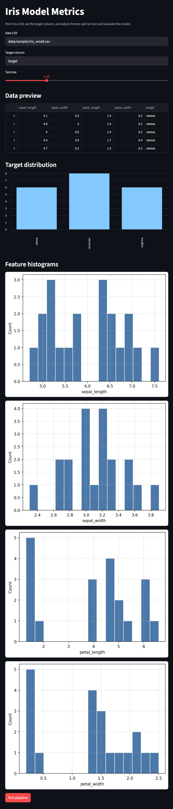

# ai-analytics

Bootstrap Python analytics repo with linting, typing, testing, CI, and a small example pipeline on the Iris dataset. Use this as a starting point for tabular ML experiments and simple dashboards.

## Quickstart
- Create a virtual env: `python -m venv .venv && source .venv/bin/activate`
- Install dependencies + local package: `pip install -r requirements.txt && pip install -e .` (or `make install`)
- Run checks: `make lint`, `make test`, `make check`
- Train example model: `python -m ai_analytics.pipeline --data data/sample/iris_small.csv --target target`
- Launch demo dashboard: `python -m streamlit run src/ai_analytics/dashboard.py` (defaults to business demo price regression; adjust in the UI)

## Run the Example Pipeline
- CLI: `python -m ai_analytics.pipeline --data data/sample/iris_small.csv --target target --test-size 0.2`
  - Add `--save-metrics artifacts/metrics.json` to persist results.
- Business demos:
  - Price bucket classification: `python -m ai_analytics.pipeline --data data/sample/business_sales_demo.csv --target price_bucket --task classification --test-size 0.2`
  - Price regression: `python -m ai_analytics.pipeline --data data/sample/business_sales_demo.csv --target unit_price --task regression --test-size 0.2`
  - Price regression with plot: `python -m ai_analytics.business_price_regression_plot` (saves `artifacts/price_regression.png`)
- Dashboard: `python -m streamlit run src/ai_analytics/dashboard.py` (defaults to the business sales demo, target `price_bucket`, and task `regression`—adjust in the UI as needed).
- From code:  
  ```python
  from ai_analytics.pipeline import run_pipeline

  metrics = run_pipeline("data/sample/iris_small.csv", target="target", test_size=0.2)
  print(metrics)
  ```
- Notebook: open `notebooks/sample_analysis.ipynb` after activating the venv.
- Example metrics snapshot (generated from the sample pipeline):  
  

## Project Layout
- `src/ai_analytics/`: package code (data loading, feature prep, model pipeline, CLI)
- `tests/`: pytest-based unit tests mirroring `src/`
- `data/sample/`: small, redacted datasets safe for git
- `notebooks/`: exploratory notebooks (outputs kept light)
- `.github/workflows/`: CI for lint + tests

## Business price demos
- Classification script: `python -m ai_analytics.business_price_bucket_demo` (predicts `price_bucket`)
- Regression script: `python -m ai_analytics.business_price_regression_demo` (predicts `unit_price`)
- Regression plot: `python -m ai_analytics.business_price_regression_plot` -> `artifacts/price_regression.png`

## Sample Data
- `data/sample/iris_small.csv`: classic Iris classification data with a `target` column for quick model demos.
- `data/sample/business_sales_demo.csv`: synthetic retail and B2B sales transactions (dates, regions, channels, products, pricing, revenue, COGS, profit) with a `price_bucket` column (<100, 100–300, >300) for price-classification demos and dashboarding.

## Key Commands
- `make lint`: ruff (lint) + mypy (type check)
- `make format`: black + isort
- `make test`: run pytest suite
- `make check`: lint + tests

## Notes
- Keep raw or sensitive data out of git; use `data/raw/` (ignored) for local work.
- Extend the pipeline by adding new modules under `src/ai_analytics/` and matching tests in `tests/`.
